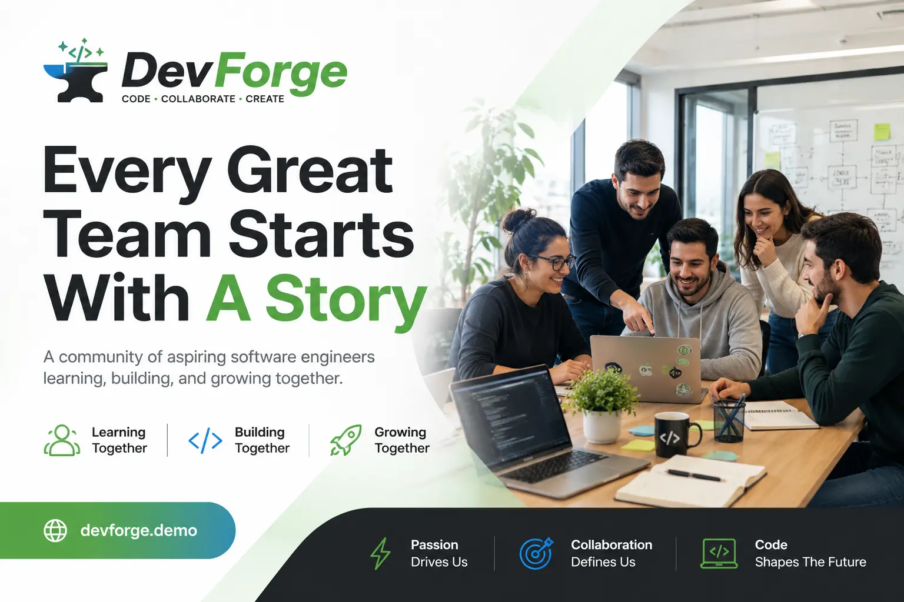

# DevForge


> Learning. Building. Growing Together.

DevForge is a fictional software engineering team website created as part of the Neoversity Software Engineering program.

The project showcases a modern landing page with information about the team, individual members, technical skills, collaboration values, and future goals.

---

## Preview



---

## Features

- Modern responsive landing page
- Team members section with interactive modal windows
- Skills & superpowers presentation
- Future roadmap section
- Reusable React components
- Semantic HTML
- CSS Modules
- Smooth scrolling navigation
- SEO optimized metadata
- Open Graph support
- Fully responsive layout

---

## Built With

- Next.js
- React
- TypeScript
- CSS Modules
- Open Sans
- Montserrat

---

## Project Structure

```
src/
│
├── app/
├── components/
├── data/
├── styles/
├── types/
└── public/
```

---

## Sections

- Hero
- About Team
- Team Members
- Superpowers
- Future Vision
- Footer

---

## Team Member Cards

Each team member includes:

- Profile photo
- Personal story
- Experience
- Technical skills
- Future goals
- GitHub
- LinkedIn
- Interactive modal window

---

## SEO

The project includes

- Open Graph metadata
- Twitter Cards
- Canonical URLs
- Favicon
- Responsive images

---

## Responsive

Optimized for

- Desktop
- Tablet
- Mobile

---

## Getting Started

Clone repository

```bash
git clone https://github.com/oxonomy14/neoversity-soft-skills-hw1.git
```

Install dependencies

```bash
npm install
```

Run development server

```bash
npm run dev
```

Build production version

```bash
npm run build
```

---

## Author

**Andrii Semenenko**

Frontend Developer

GitHub:
https://github.com/oxonomy14

LinkedIn:
https://www.linkedin.com/in/andriisemenenko

---

## License

This project was created for educational purposes as part of the **Neoversity Software Engineering Program**.
